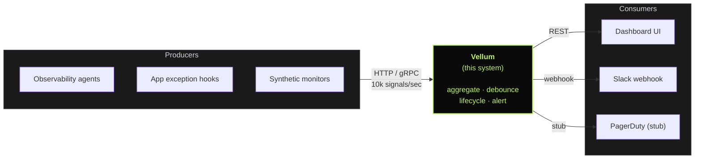
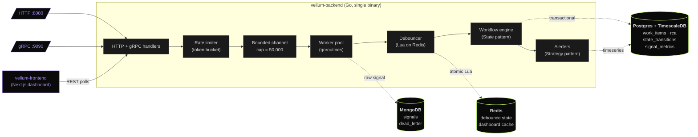

# 01 — Architecture & System Design: Incident Management System

> **Document:** `01-architecture.md`
> **Version:** 1.0 (draft)
> **Companion to:** `00-master-prd.md`

---

## 1. Purpose of This Document

This document describes **how** the Incident Management System is built — the runtime topology, the flow of a signal from ingestion to closure, the design patterns that govern the workflow, and the failure modes we explicitly designed against. It is the second document you read after `00-master-prd.md`.

This document does not duplicate requirements (see `00-master-prd.md`) and does not contain executable code (see phase files). It is the conceptual map that lets every later decision be defended in an interview.

### How to use it

- Read end-to-end once.
- Before Phase 2 build: re-read §3 (runtime topology) and §4 (ingestion deep-dive).
- Before Phase 3 build: re-read §5 (debounce) and §6 (persistence fan-out).
- Before Phase 4 build: re-read §7 (design patterns).
- Use §9 (failure modes) to challenge any code Claude generates: "what happens when X dies?"

---

## 2. System Context — Where the Vellum Sits

The Vellum is the orchestration layer between raw observability signals and human responders. At the boundaries:



Producers emit signals at high rates. Vellum aggregates them into work items, runs them through a lifecycle, and emits alerts. Consumers are humans (via dashboard) and machines (alerter webhooks).

For this build, producers are mocked by the failure-simulator script in `/scripts/`, and the only real consumer integration is an optional Slack webhook. Everything else (PagerDuty, etc.) is stubbed.

---

## 3. Runtime Topology

All processes run as containers in a single docker-compose network. Production would split these across hosts; the design supports it but the dev environment co-locates them.



### 3.1 Single-binary backend

The Go service is a single binary running HTTP and gRPC on different ports (8080 and 9090 respectively), with internal goroutines for the worker pool, metrics ticker, and graceful shutdown handler. There is no separate "ingestor" and "processor" service; they share an in-process channel.

This is a deliberate choice for v1. In production you would split them so that ingestion can scale independently — and our design (Redis-backed debounce, transactional Postgres state) is ready for that split. For the assignment, the simpler topology demonstrates the concepts more clearly.

### 3.2 Why these four data stores

This is the most common follow-up interview question. **Memorize the answer.**

| Store | Role | Why this one and not another |
|---|---|---|
| **Postgres** | Source of truth for work items, RCAs, state transitions | Work items have relations (RCA, transitions, alerts) and need ACID. State changes must be transactional or two replicas could split-brain a transition. JSON columns let us store flexible metadata without giving up SQL. |
| **MongoDB** | High-volume audit log of every raw signal | Signal payloads are heterogeneous (every source emits different fields). Writing 10K/sec into Postgres with JSONB is possible but Mongo is purpose-built for append-only, schema-flexible, secondary-indexed document stores. Compound index on `(component_id, timestamp)` gives O(log n) detail-page reads. |
| **Redis** | Debounce state + dashboard hot cache | Debounce needs atomic check-then-act, achievable via Lua script. Dashboard refreshes every 2 seconds — hammering Postgres for each refresh would not scale. Sorted sets sort the live feed by severity in O(log n). |
| **TimescaleDB** | Timeseries aggregates | Signal rate, MTTR distribution, debounce ratio per minute. Hypertables auto-partition by time. Lives inside Postgres as an extension, so one less container and one less driver than running Prometheus. Continuous aggregates pre-roll the rollups. |

---

## 4. Ingestion Pipeline — End-to-End Walkthrough

Follow a single signal from the wire to the work item.

### 4.1 The pipeline stages

```
HTTP POST /v1/signals   gRPC stream     +-- rate limit (token bucket, per-source)
        |                    |          |
        +-------+------------+          |
                v                       |
        +------------------+            |
        |  Handler         | -----------+
        |  - validate      |
        |  - rate-limit    |
        |  - enqueue       |
        +------------------+
                |
                v
        +-----------------------+
        |  Bounded channel      |   capacity = 50,000
        |  (signal queue)       |   full -> 503 / ResourceExhausted
        +-----------------------+
                |
                v   ... N workers consume in parallel ...
        +-----------------------+
        |  Worker (goroutine)   |
        |  - debounce check     |
        |  - persist fan-out    |
        |  - alert if new WI    |
        +-----------------------+
```

### 4.2 Why a bounded channel is the entire backpressure story

A Go channel with a fixed capacity is a thread-safe queue with a built-in size limit. Sending on a full channel blocks the sender. We do not want senders to block (they are HTTP/gRPC handlers — blocking ties up server resources), so we use the non-blocking `select` pattern:

```go
select {
case s.queue <- signal:
    // accepted
    return c.JSON(202, gin.H{"status": "accepted", "signal_id": signal.ID})
default:
    // queue full — push back immediately
    return c.JSON(503, gin.H{
        "error": "ingestion queue full",
        "retry_after_ms": 100,
    })
}
```

That's it. That's the backpressure mechanism. The channel size becomes a knob: bigger means we can absorb larger bursts at the cost of more memory; smaller means we 503 sooner and shield downstream more aggressively. We size it for ~5 seconds of worst-case bursts at 10K/sec = 50,000.

### 4.3 Worker pool sizing

Number of workers = `runtime.NumCPU() * 2`. The factor of 2 is heuristic — workers are largely waiting on I/O (Redis, Postgres, Mongo) so we benefit from oversubscribing CPUs. For an 8-core dev machine that's 16 workers, each running an infinite loop:

```go
for {
    select {
    case <-ctx.Done():
        return
    case sig := <-s.queue:
        s.processSignal(ctx, sig)
    }
}
```

Workers do not have ids, do not share state with each other, and are interchangeable. Each call to `processSignal` is self-contained.

### 4.4 Why we don't put Kafka or NATS in front

A common reflex is to put a message broker between the HTTP layer and the workers. We deliberately don't, for v1:

- It would add an ops dependency (another container, another driver) for capability we already get from the in-process channel.
- At 10K/sec on a single machine, an in-process channel is dramatically faster than any broker.
- Brokers earn their place when you need durability across process restarts or fan-out to multiple consumers. We have neither in v1; signals are inherently lossy (the producers are firing-and-forgetting anyway).

This is a tradeoff to defend in interviews. The defense is: *"the in-process channel meets the throughput requirement with one less moving part. The interface to the workers is just `chan Signal`, so adding Kafka later is a swap, not a rewrite."*

---

## 5. Debounce Engine

This is the single most interesting subsystem in the project. Internalize how it works.

### 5.1 The rule, restated

- Window: 10 seconds long, counted from the first signal of a quiet component.
- Cap: 100 signals per window.
- Outside the window, OR past the cap → next signal opens a new Work Item with a fresh window.
- All raw signals are persisted regardless. The window only controls how many Work Items get created.

### 5.2 Why Redis with a Lua script

The debounce decision is a classic **check-then-act**:

1. Read: does an active window exist for this `component_id`?
2. If yes and `count < 100`: increment count, attach signal to existing Work Item.
3. If no or `count == 100`: create new Work Item, set window to this signal.

Between step 1 and step 3, another worker on another machine (or in another goroutine) could slip in and make a conflicting decision. That's the race condition. If we ran two ingestion replicas, both workers seeing the first signal could each "create a new work item," producing two.

**Solutions:**

- Distributed lock per `component_id` — adds latency, can deadlock.
- Single-threaded debouncer (a goroutine that owns the map, talked to via a channel) — works, but only within one process; doesn't scale to multiple ingestion replicas.
- **Atomic op in Redis via Lua** — Redis executes scripts single-threaded server-side, so the entire check-then-act is one atomic step. This is the chosen approach.

### 5.3 The Lua script

```lua
-- KEYS[1] = debounce:{component_id}:work_item
-- KEYS[2] = debounce:{component_id}:count
-- ARGV[1] = candidate_work_item_id (used only if a new window opens)
-- ARGV[2] = window_seconds (10)
-- ARGV[3] = max_signals (100)

local existing = redis.call('GET', KEYS[1])
local count = tonumber(redis.call('GET', KEYS[2]) or '0')

if existing and count < tonumber(ARGV[3]) then
    redis.call('INCR', KEYS[2])
    return {existing, 'JOINED', count + 1}
else
    redis.call('SET', KEYS[1], ARGV[1], 'EX', ARGV[2])
    redis.call('SET', KEYS[2], '1', 'EX', ARGV[2])
    return {ARGV[1], 'CREATED', 1}
end
```

### 5.4 The signal-to-work-item linkage

The script returns the `work_item_id` (existing or new) and the action taken. The Go worker then:

- Persists the raw signal to Mongo with that `work_item_id` stamped on it (this is how we "link the 100 signals to one Work Item").
- If action == `CREATED`: persists a new Work Item row to Postgres in `OPEN` state, fires the alerter.
- If action == `JOINED`: increments the Work Item's `signal_count` in Postgres (single UPDATE).

### 5.5 Failure mode: Redis down

If the Lua call fails (network, Redis unreachable), the worker logs the degradation and falls through to "always `CREATED`." Result: more work items than intended (no debouncing) but no signals lost, no crash. The system continues. When Redis returns, debounce auto-recovers — no manual intervention.

---

## 6. Persistence Fan-out

### 6.1 What gets written where, per signal

| Store | Write | Notes |
|---|---|---|
| **MongoDB** | Insert raw signal document into `signals` collection, indexed on `(component_id, ts)` and `(work_item_id, ts)` | Always written, every signal. The audit log requirement. |
| **Postgres** | If new window: INSERT work_item row. Else: UPDATE `signal_count` and `last_signal_ts` on existing work_item. | Transactional. Single-row writes either way. |
| **Redis** | `ZADD` on `dashboard:incidents:active` keyed by severity score. `HSET` on `dashboard:incident:{id}` summary. | Powers the live feed without round-tripping Postgres. |
| **TimescaleDB** | INSERT into `signal_metrics` hypertable: `(ts, component_type, severity, count=1)` | Continuous aggregates roll this up to per-minute buckets. Used for the bonus Grafana dashboard. |

### 6.2 Are these four writes a transaction?

**No — and intentionally so.** They are independent. The model is: the Postgres write is the source of truth; the others are derivatives. If Mongo is slow but Postgres succeeded, we still have a valid Work Item; the audit log is eventually consistent. If Redis is down, the live feed is briefly stale but recovers.

This is the kind of pragmatic distributed-systems tradeoff interviewers look for. We sacrifice strong consistency across stores for availability + performance, and we are explicit about it. The one transactional boundary we DO enforce is the Postgres state transition (§7.2).

### 6.3 Retry-with-backoff

Each store write is wrapped with exponential backoff (`cenkalti/backoff/v4`): base 100ms, multiplier 2, max 3 attempts. Final failure pushes the record to the Mongo `dead_letter` collection with the error and original payload. The dead_letter is human-inspected; we do not auto-replay in v1.

This is the "evidence of retry logic" the rubric explicitly calls out — make it visible in the code, mention it in the README.

---

## 7. Design Patterns in This System

The assignment grades LLD at 20% and explicitly calls out Strategy and State. Both are implemented as small, idiomatic Go interfaces — not Java-style class hierarchies.

### 7.1 Strategy pattern: Alerter selection

Different component types and severities deserve different alert channels. Hardcoding `if severity == P0 { pagerDuty() } else { ... }` is the smell we're avoiding.

```go
type Alerter interface {
    Name() string
    Dispatch(ctx context.Context, wi WorkItem) error
}

type AlerterRegistry struct {
    rules    []Rule              // ordered match rules
    alerters map[string]Alerter
}

func (r *AlerterRegistry) ForWorkItem(wi WorkItem) Alerter {
    for _, rule := range r.rules {
        if rule.Matches(wi) {
            return r.alerters[rule.AlerterName]
        }
    }
    return r.alerters["console"] // fallback
}
```

Adding a new alerter (PagerDuty, OpsGenie, Microsoft Teams) means: write one struct implementing `Alerter`, register it, add a `Rule`. Zero changes to ingestion, workflow, or persistence. That's the value of the pattern.

#### 7.1.1 Concrete alerters for v1

- `PagerDutyStub` — for P0. Logs a structured 'as-if' PagerDuty payload to stdout. Real integration would replace this struct.
- `SlackWebhook` — for P1, P2. Real HTTP POST to a configured webhook URL. Falls back to console if URL not set.
- `Console` — fallback for P3 and anything not matched.

### 7.2 State pattern: Work Item lifecycle

Work Item state-specific behaviour (which transitions are allowed from here? what runs when you enter this state? what runs when you exit?) lives in state objects, not in a switch statement in the Work Item type.

```go
type State interface {
    Name() string
    CanTransitionTo(next State, ctx TransitionContext) error
    OnEnter(ctx context.Context, wi *WorkItem) error
}

type OpenState struct{}
type InvestigatingState struct{}
type ResolvedState struct{}
type ClosedState struct{}

func (s ResolvedState) CanTransitionTo(next State, ctx TransitionContext) error {
    switch next.(type) {
    case ClosedState:
        if ctx.RCA == nil {
            return ErrMissingRCA
        }
        if err := ctx.RCA.Validate(); err != nil {
            return fmt.Errorf("RCA incomplete: %w", err)
        }
        return nil
    default:
        return ErrInvalidTransition
    }
}

func (s ClosedState) OnEnter(ctx context.Context, wi *WorkItem) error {
    wi.MTTRSeconds = int(wi.IncidentEnd.Sub(wi.IncidentStart).Seconds())
    wi.ClosedAt = time.Now()
    return nil
}
```

Properties of this design:

- The rule "cannot CLOSE without RCA" is in **ONE place**: `ResolvedState.CanTransitionTo`. A reviewer can find it in 5 seconds.
- Adding a new state (e.g. `ACKNOWLEDGED` between OPEN and INVESTIGATING) is a one-file change.
- MTTR computation is automatic — happens when entering `ClosedState`.
- Backward transitions and skips are blocked by default.

#### 7.2.1 The transactional wrapper

A Work Item transition is not just a memory operation — it must be persisted atomically. The flow:

1. Begin Postgres transaction (SERIALIZABLE isolation).
2. `SELECT FOR UPDATE` the `work_item` row by id.
3. Construct current State from the row's status. Call `CanTransitionTo(next, ctx)`.
4. If allowed: call `next.OnEnter`, UPDATE `work_items`, INSERT `state_transitions` row.
5. Commit or rollback.

This means: two concurrent requests to close the same incident cannot both succeed. The `SELECT FOR UPDATE` serializes them; whoever loses retries or gets a 409 Conflict.

### 7.3 Other patterns at play (named for interview readiness)

- **Producer-consumer.** The bounded channel between handlers and workers is the textbook implementation.
- **Repository pattern.** Postgres access goes through a `WorkItemRepository` interface; the implementation uses pgx. Swappable for tests with in-memory fake.
- **Circuit breaker (light).** If a sink's failure rate exceeds a threshold, we stop trying for a short window. Implemented as a flag on the writer; full `sony/gobreaker` would be overkill but mentionable.
- **Observer (light).** Metrics ticker observes counters; alerters observe Work Item creation. We do not implement a generic event bus.
- **Graceful shutdown via context propagation.** Every long-running goroutine receives a ctx; on SIGTERM, ctx is cancelled; workers drain the queue with a deadline.

---

## 8. Walkthrough: One Signal, End to End

Trace a single P0 signal for component `CACHE_CLUSTER_01` through the system, from HTTP POST to Work Item creation to dashboard visibility. This is the explanation you give in interviews.

1. Client POSTs to `/v1/signals` with JSON body containing `component_id`, `severity`, `payload`, etc.
2. Gin middleware: token-bucket rate-limit check by source IP. Pass.
3. Gin handler: validates required fields, generates `signal_id` if absent, attempts non-blocking send to the bounded channel. Channel has room — accepted. Returns 202 with `signal_id` in under 1ms.
4. A worker goroutine picks up the signal from the channel.
5. Worker calls `debouncer.Process(signal)`. Debouncer runs the Lua script against Redis.
6. Redis sees no existing window for `CACHE_CLUSTER_01`. Sets `debounce:CACHE_CLUSTER_01:work_item = newUUID` with TTL 10s, count = 1. Returns `(newUUID, CREATED, 1)`.
7. Worker writes the raw signal to MongoDB with `work_item_id` stamped on it.
8. Worker writes a new `work_item` row to Postgres in `OPEN` state via the `WorkItemRepository`.
9. Worker calls `alerterRegistry.ForWorkItem(wi)` which returns `PagerDutyStub` (P0 rule matched).
10. `PagerDutyStub.Dispatch` logs the alert payload to stdout (in a real integration, posts to PagerDuty Events API).
11. Worker writes the work_item summary to Redis sorted set `dashboard:incidents:active` with severity score, and hash `dashboard:incident:{id}` for the summary card.
12. Worker writes a 1-row insert into TimescaleDB `signal_metrics` hypertable.
13. All four writes succeed. Worker returns to channel-wait.
14. Meanwhile, the dashboard live feed polls `GET /v1/incidents` every 2 seconds. Backend reads from `dashboard:incidents:active` (Redis sorted set). The new P0 incident appears at the top.
15. On-call SRE clicks the incident. Frontend calls `GET /v1/incidents/:id` and `GET /v1/incidents/:id/signals`. Backend reads work_item from Postgres, signals from Mongo with index on `(work_item_id, ts)`.
16. SRE moves the incident to `INVESTIGATING` via `PATCH /v1/incidents/:id/state`. Backend wraps the transition in a Postgres SERIALIZABLE transaction, calls the State pattern, writes work_item update + state_transitions row, commits.
17. Many hours later, the SRE submits an RCA. Backend validates required fields, inserts `rca` row, sets the Work Item to `RESOLVED`, then to `CLOSED` in a final transition that calls `ClosedState.OnEnter`, computing MTTR.

---

## 9. Failure Modes — What Breaks and How We Survive

This table is the most defensible piece of the design. Be ready to talk through every row.

| Failure | What happens | How we mitigate |
|---|---|---|
| **Postgres slow (high latency)** | Worker pool fills up because each signal takes longer to process; channel fills up; handlers start 503'ing | By design. Backpressure is the correct response: tell upstream to slow down rather than crash. Sufficient channel capacity (~5s of nominal load) absorbs short spikes. |
| **Postgres unavailable** | Work item write fails | Retry with backoff (100ms, 200ms, 400ms). After 3 attempts, push to `dead_letter` Mongo. Raw signal still persisted to Mongo, so audit log is intact. Workers don't get stuck. |
| **Redis unavailable** | Debounce script call fails | Degraded mode: treat every signal as `CREATED`. Log a structured warning. More work items than ideal, but no signals lost. Live feed stale until Redis recovers (frontend shows last-known state). |
| **MongoDB unavailable** | Raw signal write fails | Retry with backoff. After exhaustion, push to a circular in-memory ring buffer (best-effort) and log error. Work item creation still succeeds. Lost audit signals are acceptable; lost work items are not. |
| **Signal queue full** | New signals rejected with 503 | By design. Caller (observability agent) is expected to retry with backoff or buffer locally. We provide `Retry-After` hint. |
| **Worker panics** | That worker goroutine dies | Top-level `recover()` in worker loop; logs the panic with stack and restarts the worker. Channel keeps draining via the other workers. |
| **Two concurrent CLOSE requests** | Race to close the same Work Item | Postgres SERIALIZABLE transaction + `SELECT FOR UPDATE` on the work_item row. One commits, the other returns 409 Conflict. |
| **Process SIGTERM** | Container being recycled | Signal handler cancels root context. Workers finish their current signal, then exit. Handlers stop accepting new signals. 30-second drain deadline before hard exit. In-flight channel items: best-effort. |
| **Alerter webhook slow/failing** | Alert dispatch takes seconds | Alerter runs in a separate goroutine, not on the worker hot path. Has its own timeout (5s). Failure logged, does not block workflow. |

---

## 10. Repository Layout

Standard Go project layout with `internal/` for non-exported packages. Frontend in a sibling folder.

```
vellum/
├── backend/
│   ├── cmd/
│   │   └── vellum/main.go           # entrypoint; wires everything
│   ├── internal/
│   │   ├── ingest/                  # HTTP + gRPC handlers, rate limit
│   │   ├── pipeline/                # channel, worker pool, metrics
│   │   ├── debounce/                # Lua script wrapper, fallback
│   │   ├── workflow/                # State pattern, transitions, RCA
│   │   ├── alert/                   # Strategy pattern, alerters
│   │   ├── persist/
│   │   │   ├── pg/                  # Postgres repo (pgx)
│   │   │   ├── mongo/               # Mongo repo
│   │   │   ├── redis/               # Redis client + scripts
│   │   │   └── timescale/           # TimescaleDB writer
│   │   ├── api/                     # Gin routes, gRPC server
│   │   ├── model/                   # Shared types (Signal, WorkItem, RCA)
│   │   └── obs/                     # /health, metrics ticker
│   ├── proto/                       # .proto files + generated code
│   ├── migrations/                  # SQL migrations (golang-migrate)
│   ├── testdata/
│   ├── go.mod
│   └── Dockerfile
├── frontend/
│   ├── app/                         # Next.js App Router
│   │   ├── page.tsx                 # live feed
│   │   ├── incidents/[id]/page.tsx              # detail
│   │   └── incidents/[id]/rca/page.tsx          # RCA form
│   ├── components/                  # shadcn/ui + composed
│   ├── lib/                         # api client
│   ├── package.json
│   └── Dockerfile
├── docker/
│   ├── compose.yaml
│   └── postgres/init.sql            # creates TimescaleDB extension
├── scripts/
│   ├── simulate-outage.go           # failure simulator
│   └── load-test.sh                 # vegeta script
├── docs/
│   ├── 00-master-prd.md
│   ├── 01-architecture.md
│   ├── 02-data-models.md
│   ├── 03-api-contract.md
│   ├── phases/
│   │   ├── phase-1-foundation.md
│   │   └── ...
│   ├── decisions.md                 # ADR-lite
│   └── prompts.md                   # what we asked Claude
├── CLAUDE.md                        # operational rules for Claude Code
└── README.md
```

### 10.1 The dependency rule

Packages depend **inward**: `api/` depends on `workflow/`, `workflow/` depends on `persist/` and `model/`. Lower packages do not import upper packages. There are no cycles. This is what "clean separation of concerns" looks like and what a reviewer checks first.

---

## 11. Observability

### 11.1 `/health`

Returns 200 + JSON when all critical dependencies (Postgres, Mongo, Redis) are reachable. Returns 503 if any critical dependency is down. TimescaleDB shares Postgres so it's covered.

Sample response:

```json
{
  "status": "healthy",
  "uptime_seconds": 1843,
  "queue_depth": 47,
  "queue_capacity": 50000,
  "dependencies": {
    "postgres": {"status": "up", "latency_ms": 2},
    "mongo":    {"status": "up", "latency_ms": 4},
    "redis":    {"status": "up", "latency_ms": 1}
  }
}
```

### 11.2 Throughput log line

Every 5 seconds, a metrics goroutine prints:

```
[metrics] accepted=8421/s processed=8398/s queue=312/50000 debounce_hit_rate=0.97 new_work_items=12 errors=0
```

Format is single-line, parseable. In production this would be a `/metrics` endpoint scraped by Prometheus; the assignment specifically asks for console print, so we do both (env-flag controls).

### 11.3 Structured logging

`zap` or `zerolog` at INFO. One log line per state transition, one per alert dispatch, one per dead-letter, one per retry. Trace correlation via `signal_id` and `work_item_id` fields on every line.

---

## 12. Architectural Decisions to Revisit

These are choices made for v1 that a senior reviewer might challenge. Be ready with the answer.

- **Q: Why not Kafka in front of the workers?** Answered in §4.4. In-process channel meets throughput; interface is `chan Signal`; swap is local.
- **Q: Why not gRPC-only?** HTTP is the lowest-friction protocol for the failure simulator, ad-hoc curl debugging, and the dashboard's polling. gRPC streaming is added for the high-volume internal source case.
- **Q: Why a polling dashboard instead of SSE / WebSocket?** Polling at 2s is good enough for the demo and is simpler. WebSocket is on the bonus list (B2).
- **Q: Why is debounce keyed only by `component_id` and not `(component_id, error_type)`?** v1 simplicity. A real Vellum would cluster on multiple dimensions; we explicitly note this as a future evolution.
- **Q: Why not auto-replay dead-letter?** Most dead-letters are caused by schema drift or persistent backend failure; auto-replay risks loops. Human inspection is intentional for v1.
- **Q: Why TimescaleDB and not Prometheus?** Prometheus is a pull-based metrics system; we need push-based timeseries on application events (signals, MTTR). Timescale-as-Postgres-extension also means one fewer driver and container.
- **Q: Why SERIALIZABLE for state transitions, not READ COMMITTED?** SERIALIZABLE protects against phantom reads on the `state_transitions` audit table. The contention is low (transitions are human-driven, not high-frequency), so the performance cost is negligible.

---

## 13. From Architecture to Code

With the master PRD (`00`) and this architecture (`01`) in hand, the foundation is set. The remaining preparation is:

1. `02-data-models.md` — concrete schemas for Postgres, Mongo, Redis, Timescale, protobuf.
2. `03-api-contract.md` — every endpoint, request/response, status codes.
3. `phases/phase-1.md` through `phase-7.md` — day-by-day build prompts.

Each phase file references this architecture by section number. Re-read the relevant section before building. The job for the next conversation is to either (a) review and amend these two documents, or (b) proceed to draft `02` and `03`.

> **Whiteboard test:** can you, right now, draw the runtime topology and describe what happens to a P0 signal end-to-end? If yes, the foundation is solid. If no, re-read §3, §4, §5, §8.
